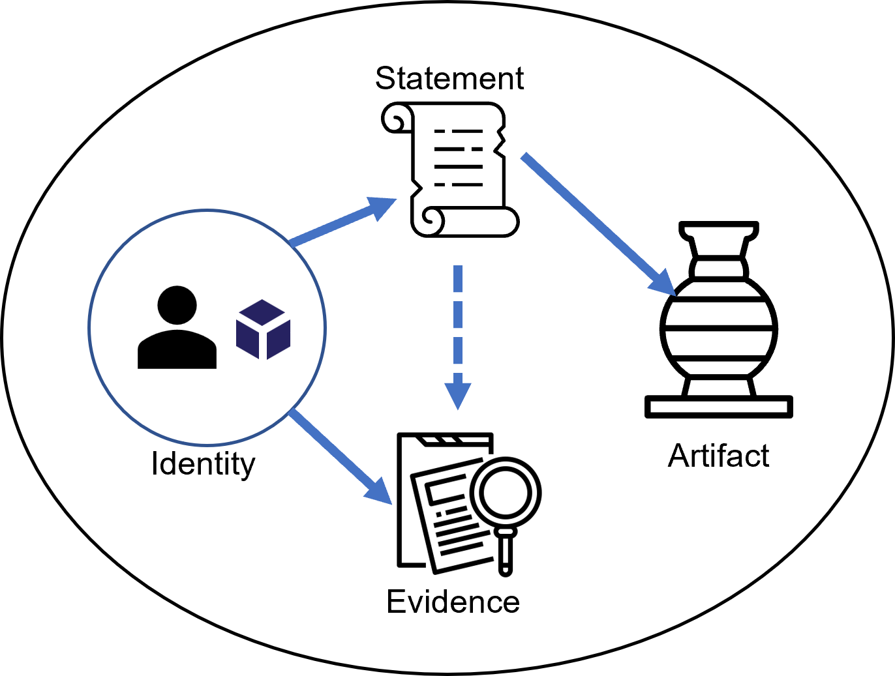
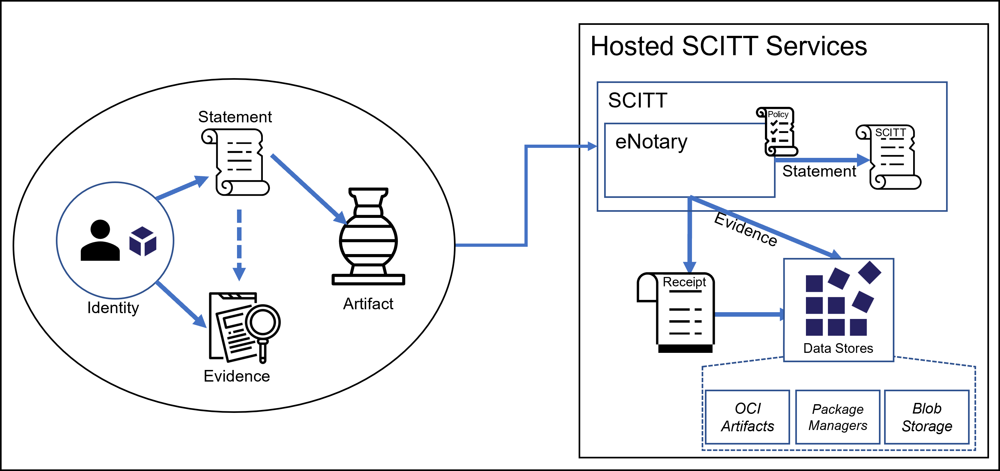

 
# What Is SCITT

The **S**upply **C**hain **I**ntegrity, **T**ransparency and **T**rust (SCITT) initiative is a set of proposed [IETF internet standards]({{ site.ietf-scitt }}){:target="_blank"} for managing the compliance of goods and services across end-to-end supply chains.
SCITT supports the ongoing verification of goods and services where the authenticity of entities, evidence, policy, and artifacts can be assured and the actions of entities can be guaranteed to be authorized, non-repudiable, immutable, and auditable.

## Interacting with SCITT

In practice, SCITT provides information about artifacts, enabling a mesh of dependencies to understand what each subsystem is consuming.
Detailed information comes in varying formats, from structured to unstructured.

In SCITT, structured data is represented as a Statement. A Statement is a well-structured statement, made by a verifiable entity that may have supporting evidence. The evidence is captured as the payload of the statement.

### Continual Updates

Documenting Statements at the time software is built or deployed would sell SCITT short, as software isn't static. Software is continually updated, and more importantly, we continually learn and want to convey new information about artifacts that have already been released. Reputable OSS Projects and Independent Software Vendors (ISVs) don't intentionally produce software they know to be vulnerable. Only after the software is public do we often find out about new vulnerabilities. SCITT is a means to convey a stream of continual updates for each versioned artifact.

## SCITT Persistence

SCITT is intended to store Signed Statements for the life of the of the SCITT instance. One of the many questions that surfaces is how big will the SCITT append-only log get? What kind of data will go on the SCITT append-only log that would cause it to grow?

### eNotary

SCITT is analogous to a digital or electronic notary service (eNotary), where minimal information is written to the append-only log and an augmented counter-signature over the Statement and corresponding metadata (Receipt) is produced. When users notarize legal documents, the notary append-only log records the verified identity of the parties, referencing the legal document they are notarizing. The notary append-only log doesn't store the legal document, but does have a reference to it. 

In SCITT, the append-only log will contain pointers to the artifact, which Statements are made, with a payload representing the contents of the statement.

### Payload Persistence

A SCITT Transparency Service will persist verifiable data structures of the Signed Statements to its append-only log. The payload may be persisted in associated storage within ancillary services, or referenced as a detached payload. Detached payloads are key as SCITT is intended to support existing storage solutions for artifacts. You don't need to move the artifacts, or the payload of the statements you wish to make, you can reference them where they already exist. For instance, if you're already storing SBOMS, Security Scans, Statements of Compliance in blob storage, you can add SCITT Signed Statements, attesting to that content at a particular point in time.

While a SCITT instance should provide a default storage, there's no limit on what storage services are used. For package managers that support breadths of content types, the payload may be stored alongside the artifact by which the Statement is being made. For package managers that limit the content types to the specific package type, a SCITT instance should provide default storage persistence.

For more info, see: [Supply Chains](./supply-chain.md)
