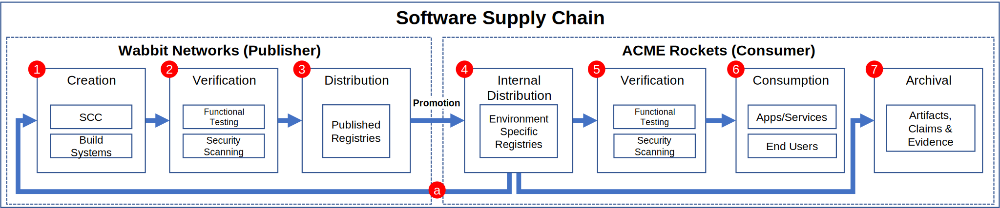

Are supply chains unique to software? Consider this definition from [Adam Hayes – Investopedia](https://www.investopedia.com/terms/s/supplychain.asp)

> _“A supply chain is a network of individuals and companies who are involved in creating a product and delivering it to the consumer. Links on the chain begin with the producers of the raw materials and end when the van delivers the finished product to the end user.”_

How does the definition relate to a software supply chain?

A supply chain spans multiple entities, requiring the promotion of artifacts across environments. In the physical world, this uses vehicles to transport (promote) between locations. In the digital world, a network is used to transport (promote) across public and private package managers.

### Supply Chain Integrity and Trust

When you consume an artifact from a new location, how does the user know it originated from a trusted producer? Do you only purchase Tylenol directly from Johnson & Johnson? Do you only acquire software directly from a vendor, or do you promote to a secured internal location within your control, just as you bring Tylenol and other goods into your home for when you need it?
As artifacts move across the supply chain, the integrity of the artifact must be maintained. 

> [How the Tylenol incident of 1982 changed the way we consume medication](https://www.pbs.org/newshour/health/tylenol-murders-1982)
>
> 
>
> Lessons from the physical supply chain can and should be implemented in the digital supply chain. Prior to 1982, medication was shipped without any concept of a safety seal. Another place we look for integrity; opening your favorite beverage. If you don’t feel the vacuum seal release, you immediately question the integrity of the product. 
>
> The Tylenol incident didn’t just change the medical supply chain, it changed the entire supply chain.

### The Software Supply Chain

1.	**Sealed and Signed Build Artifacts**: The output of the build includes a series of signed and sealed artifacts, including an SBOM and any known vulnerabilities at the time of the build.  
2.	**Verification Claims and Evidence**: While verifying the build, various testing claims may be applied, from functional test results to build composition security scans. The evidence must also have a sealed verifiable identity to assure consumers can trust the evidence.
3.	**Publisher-Distribution**: As the software is ready for distribution, a subset of information is published, as not all the build or internal details are intended to be public. Details of the build may be used for subsequent forensics if/when issues may arise.
4. **Consumer-Internal Distribution**: Consumers promote a copy of the software they take a dependency upon into their "golden registry".   
5. **Verification**: Consumers should verify the content they consume meets their specific requirements, which may be verticals or their unique business requirements.
6. **Consumption**: Deployments are made, impacting end users, based on internally verified copies of all dependencies and builds. New deployments (including scaling instances) are based on the internally verified copies.
7. **Archival**: As artifacts are moved out of production, copies are maintained for compliance. Security analysis is applied to previously deployed artifacts, enabling forensics to potential previous events.
8. **Publishers have internal golden registries** for the content they depend upon, creating the supply chain dependency loop.

## Implementing Supply Chain Artifact Distribution

The following are examples how you may distribute supply chain artifacts:

- [Distributing with OCI Registries](distributing-with-oci-registries)
- [Distributing with OCI Registries, with SCITT Enhancements](distributing-with-oci-scitt)